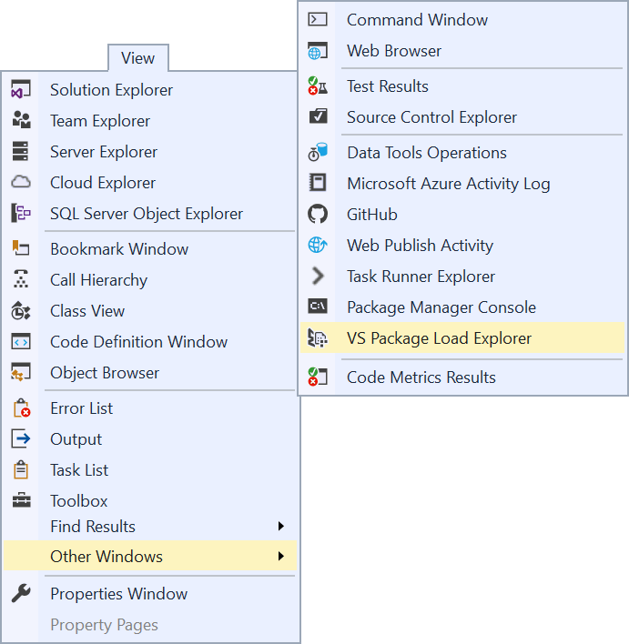
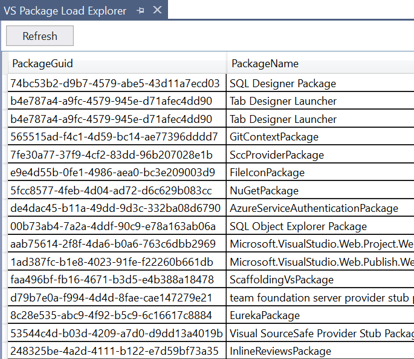

# VS Package Load Explorer

**Requires Visual Studio 2017.6 or newer**

This extension makes it easy to diagnose how packages are being loaded in Visual Studio. Both build-in as well as packages comming from external extensions are supported.

Download from the [Visual Studio MarketPlace](https://marketplace.visualstudio.com/items?itemName=MadsKristensen.PackageLoadExplorer) or get the latest [CI build](http://vsixgallery.com/extension/AutoLoadPackageManager.d28343a5-6123-475e-9f5d-63705c8e166e/).

## The Package Load Explorer window
Display it by going to **View -> Other Windows -> Package Load Explorer**.

Shows information about how the VS packages was loaded in the IDE.

The columns shown are:

* PackageGuid
* PackageName
* ModuleName
* AutoLoadContextGuid
* AutoLoadContextName
* IsRuleBasedUIContext
* UIContextTerms
* IsAsyncPackage
* IsAsyncForUIContext

## License
[Apache 2.0](LICENSE) 
